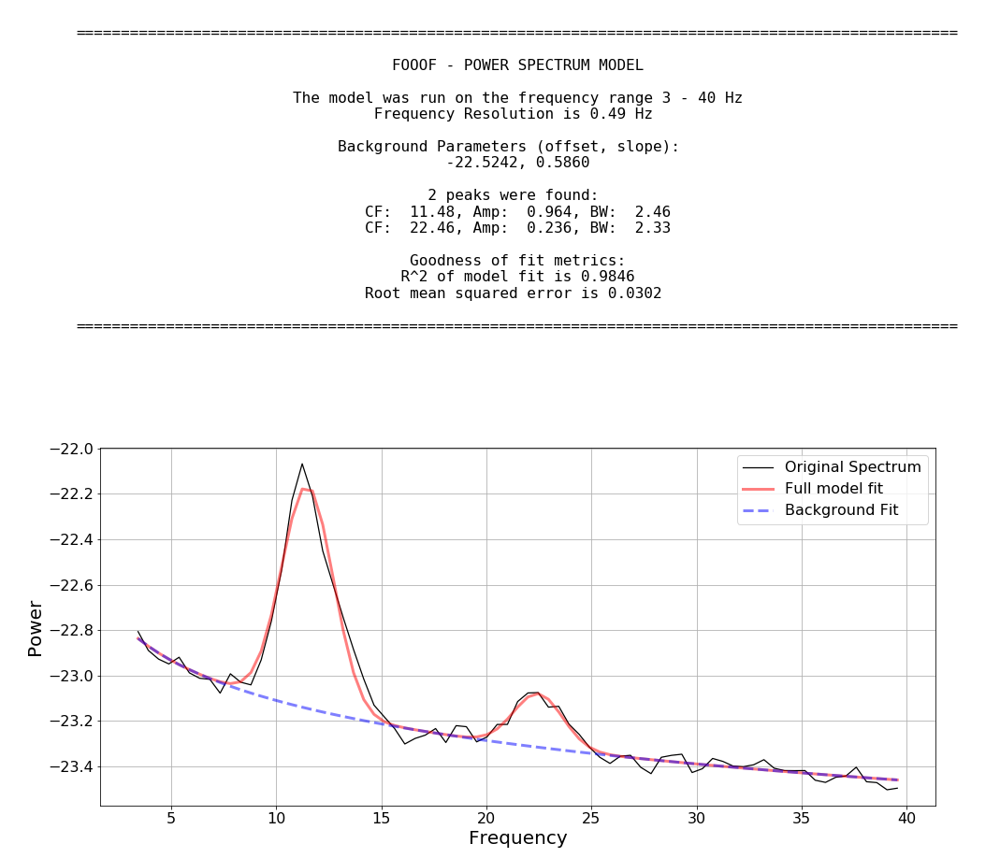
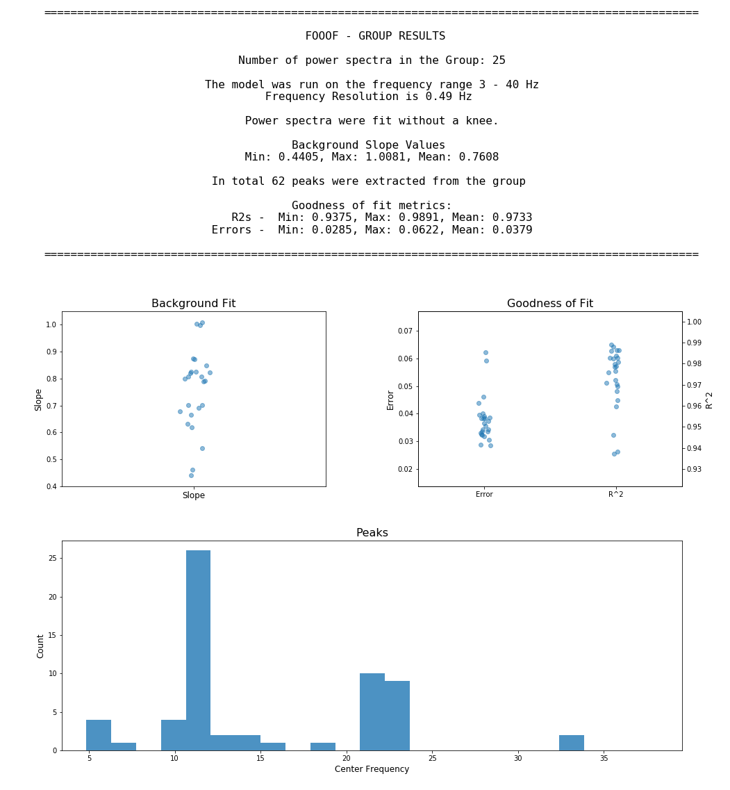

# FOOOF - fitting oscillations & one over f

[](http://www.repostatus.org/#active)
[](https://pypi.python.org/pypi/fooof/)
[](https://travis-ci.org/voytekresearch/fooof)
[](https://codecov.io/gh/voytekresearch/fooof)
[](https://opensource.org/licenses/Apache-2.0)
[](https://pypi.python.org/pypi/fooof/)

FOOOF is a fast, efficient, physiologically-informed model to parameterize neural power spectra, characterizing both the aperiodic 'background' component, and periodic components as overlying peaks, reflecting putative oscillations.

The model conceives of the neural power spectrum as consisting of two distinct functional processes:
- An aperiodic component, typically reflecting 1/f like characteristics, modeled with an exponential fit, with:
- Band-limited peaks rising above this background, reflecting putative oscillations, and modeled as Gaussians.

With regards to examing peaks in the frequency domain, as putative oscillations, the benefit of the FOOOF approach is that these peaks are characterized in terms of their specific center frequency, amplitude and bandwidth without requiring predefining specific bands of interest. In particular, it separates these peaks from a dynamic, and independently interesting aperiodic background. This conception of the aperiodic background, as potentially functional (and therefore worth carefully modeling) is based on work from our lab suggesting that the slope of this approximately 1/f distributed aperiodic background may reflect physiological parameters, particularly excitation/inhibition balance ([Gao, Peterson, Voytek, _NeuroImage_ 2017](http://voyteklab.com/wp-content/uploads/Gao-NeuroImage2017.pdf); [Voytek & Knight, _Biol Psychiatry_ 2015](http://voyteklab.com/wp-content/uploads/Voytek-BiolPsychiatry2015.pdf)). This aperiodic component changes with task ([Podvalny _et al._, _J Neurophysiol_ 2015](http://www.weizmann.ac.il/neurobiology/labs/malach/sites/neurobiology.labs.malach/files/Podvalny%20et%20al_2015_JNeurophysiol.pdf)), with aging ([Voytek _et al._, _J Neurosci_ 2015](http://voyteklab.com/wp-content/uploads/Voytek-JNeurosci2015.pdf)), and is thus interesting and important to measure, both in of itself, and to address potential confounds of the aperiodic components on the measurement of band-limited periodic components.

## Reference

A full description of the method and approach is available in the paper linked below.

If you use this code in your project, please cite:

    Haller M, Donoghue T, Peterson E, Varma P, Sebastian P, Gao R, Noto T, Knight RT, Shestyuk A,
    Voytek B (2018) Parameterizing Neural Power Spectra. bioRxiv, 299859.
    doi: https://doi.org/10.1101/299859

Link: https://www.biorxiv.org/content/early/2018/04/11/299859

## Dependencies

FOOOF is written in Python, and requires Python >= 3.5 to run. 

It has the following dependencies:
- numpy
- scipy >= 0.19
- matplotlib (optional)
- pytest (optional)

That is, if you are using [Anaconda](https://www.anaconda.com/download/), then you are good to go.

If you aren't already using Anaconda, it is a useful tool to get and manage these dependencies.

Matplotlib is not required for running the model fitting, but is used if you want to visualize model fits.

Pytest is only required to run the test suite.

## Matlab Support

FOOOF is implemented in Python, but there is also Matlab wrapper, as well as other support utilities for using FOOOF in a Matlab pipeline, all of which is available in [fooof_mat](http://github.com/voytekresearch/fooof_mat). 

## Install

To install the latest stable release of fooof, you can use pip:

`$ pip install fooof`

Note that this will install only the core (non-optional) fooof requirements.

## Development Branch

To get the lastest, development version, you can get the code using git:

`$ git clone https://github.com/voytekresearch/fooof`

To then install the development version (without making changes to it), move into the directory you cloned and run:

`$ pip install .`

Otherwise, if you want to install an editable, development version, move into the directory you cloned and install with:

`$ pip install -e .`

## Usage

FOOOF is object oriented, and generally follows a similar approach as used in scikit-learn.

The algorithm works on frequency representations, that is power spectra in linear space.

With a power spectrum loaded (with 'freqs' storing frequency values, and 'spectrum' storing the power spectrum, both as 1D arrays in linear space) FOOOF can be used as follows:

```python
from fooof import FOOOF

# Initialize FOOOF object
fm = FOOOF()

# Define frequency range across which to model the spectrum
freq_range = [3, 40]

# Model the power spectrum with FOOOF, and print out a report
fm.report(freqs, spectrum, freq_range)
```

FOOOF.report() fits the model, plots the original power spectrum with the associated FOOOF model fit, and prints out the parameters of the model fit for both aperiodic 'background' and Gaussian parameters for any identified peaks.

FOOOF also accepts parameters for fine-tuning the fit. For example:

```python
fm = FOOOF(peak_width_limits=[1.0, 8.0], max_n_peaks=6, min_peak_amplitude=0.1, peak_threshold=2.0)
```

* _peak_width_limits_ sets the possible lower- and upper-bounds for the fitted peak widths.
* _max_n_peaks_ sets the maximum number of peaks to fit (in decreasing order of amplitude).
* _min_peak_amp_ sets an absolute limit on the minimum amplitude (above background) for any extracted peak.
* _peak_threshold_, also sets a threshold above which a peak amplitude must cross to be included in the model. This parameter is in terms of standard deviation above the noise of the flattened spectrum.

FOOOF also has convenience methods for running the FOOOF model across matrices of multiple power spectra, as well as functionality for saving and loading results, creating reports from FOOOF outputs, and utilities to further analize FOOOF results.

An example workflow, with 'freqs' as 1D array of frequency values, and 'spectra' as a 2D array of power spectra.

```python

# Initialize a FOOOFGroup object, specifying some parameters
fg = FOOOFGroup(peak_width_limits=[1.0, 8.0], max_n_peaks=8)

# Fit FOOOF model across the matrix of power spectra
fg.fit(freqs, spectra)

# Create and save out a report summarizing the results across the group of power spectra
fg.save_report()

# Save out FOOOF results for further analysis later
fg.save(file_name='fooof_group_results', save_results=True)
```

## Output
Example output for a FOOOF fit of MEG data:




Example output for running FOOOF across a group of power spectra (with FOOOFGroup):


