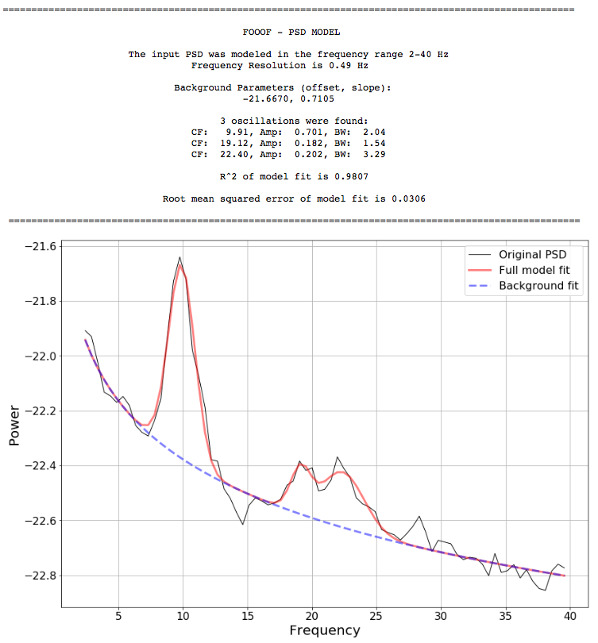

# FOOOF - fitting oscillations & one over f

[](http://www.repostatus.org/#active)
[](https://travis-ci.org/voytekresearch/fooof)
[](https://codecov.io/gh/voytekresearch/fooof)
[](https://opensource.org/licenses/Apache-2.0)

---

FOOOF is a fast, efficient, physiologically-informed model to parameterize neural power spectra.

The model conceives of the neural power spectral density (PSD) as consisting of two distinct functional processes: 1) A 1/f background modeled as a curve in log-log space with; 2) Band-limited oscillatory "bumps" rising above this background, modeled as Gaussians in log(power) space.

Note that this conception of the 1/f as potentially functional (and therefore worth carefully modeling) is based on work from our lab suggesting that the 1/f slope may index excitation/inhibition balance ([Gao, Peterson, Voytek, _NeuroImage_ 2017](http://voyteklab.com/wp-content/uploads/Gao-NeuroImage2017.pdf); [Voytek & Knight, _Biol Psychiatry_ 2015](http://voyteklab.com/wp-content/uploads/Voytek-BiolPsychiatry2015.pdf)). At the very least, however, the 1/f appears to change with task ([Podvalny _et al._, _J Neurophysiol_ 2015](http://www.weizmann.ac.il/neurobiology/labs/malach/sites/neurobiology.labs.malach/files/Podvalny%20et%20al_2015_JNeurophysiol.pdf)), with aging ([Voytek _et al._, _J Neurosci_ 2015](http://voyteklab.com/wp-content/uploads/Voytek-JNeurosci2015.pdf)).

## Python Version

FOOOF runs on Python 3.5 and 3.6.

## Dependencies

- numpy
- matplotlib
- scipy >= 0.19

## Usage

FOOOF is object oriented. With a power spectrum loaded (with 'freqs' storing frequency values, and 'psd' storing power values, both as 1D arrays in linear space) FOOOF can be used as follows:

```python
from fooof import FOOOF

# Initialize FOOOF object
foof_model = FOOOF()

# Define frequency range to model PSD
freq_range = [3, 40]

# Model the PSD with FOOOF
foof_model.model(freqs, psd, freq_range)
```

FOOOF.model() fits the model, plots the original PSD with the associated model of the PSD, and prints out the parameters of the model fit for both background 1/f (offset, knee, exponent) and Gaussian parameters (center frequency, amplitude, and bandwidth) for any identified oscillations.

FOOOF also accepts parameters for fine-tuning the fit. For example:

```python
foof_model = FOOOF(bandwidth_limits=(1.0,15.0), max_n_oscs=6, min_amp=0.1, amp_std_thresh=2.0)
```

* _bandwidth_limits_ sets the possible lower- and upper-bounds for the fitted Gaussians bandwidths to 1.0 and 15.0 Hz, respectively.
* _max_n_oscs_ sets the maximum number of oscillations to find (in decreasing order of amplitude). Physiologically, rarely are there ever more than 5 or 6. This helps minimize overfitting.
* _min_amp_ sets a hard limit on the maximum amplitude (above background 1/f) for any oscillation; that is, bumps below this amplitude will be ignored.
* _amp_std_thresh_, similar to _min_amp_, sets a threshold above which oscillation amplitude must cross to be included in the model. However this parameter is in terms of standard deviation above the noise of the flattened spectrum.

## Output
Example output for MEG data:

