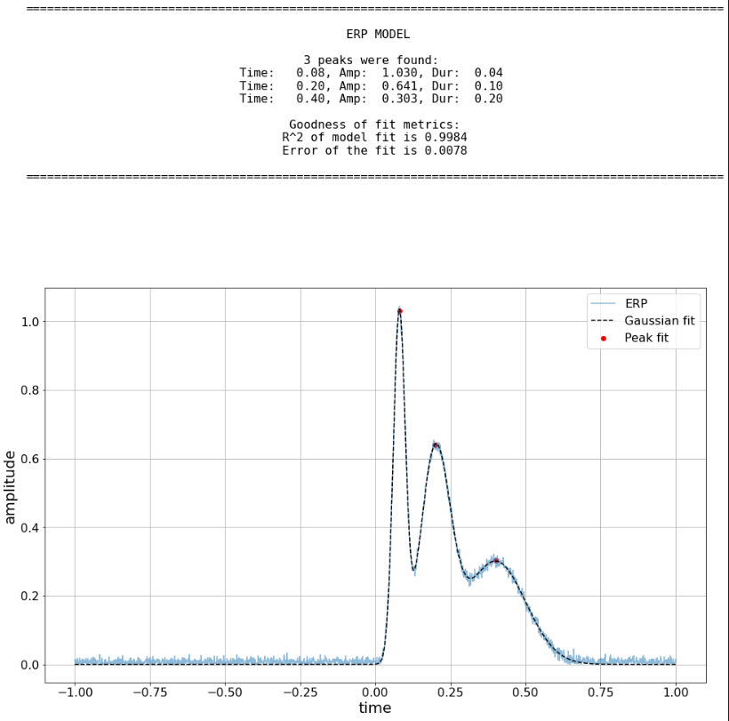
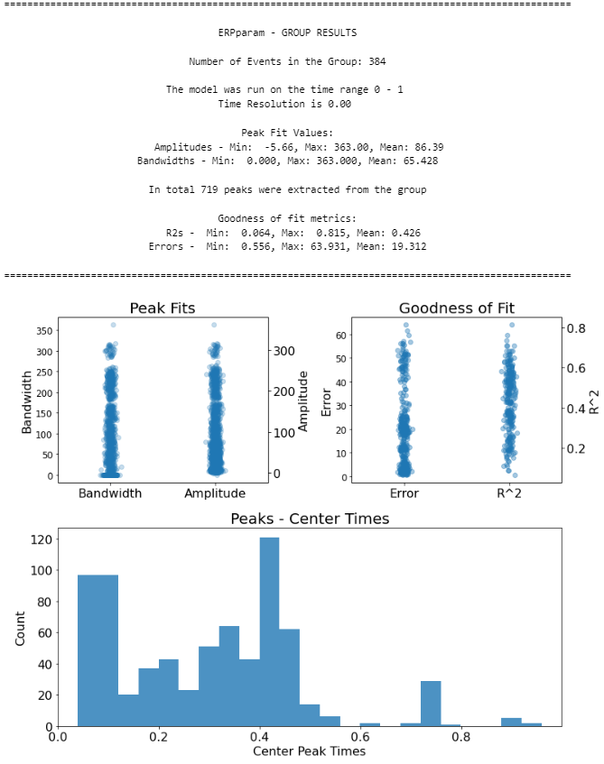

=========================================
ERPparam
=========================================

ERPparam is tool to parameterize neural evoked responses.

Quickstart
----------

**Fitting a Single Evoked Response**

With an event-related potential (ERP) loaded (with 'time' storing time points, and 'signal' storing
the ERP, ERPparam can be used as follows:

.. code-block:: python

    # Import the ERPparam object
    from ERPparam import ERPparam

    # Initialize ERPparam object
    params = ERPparam()

    # Define time range within which to model the ERP
    time_range = [0, 1]

    # Model the ERP with ERPparam, and print out a report
    params.report(time, signal, time_range)

ERPparam.report() fits the model, plots the original (or rectified) ERP with the associated ERPparam model fit,
and prints out the parameters of the model fit.

Example output for the report of a ERPparam fit on an individual ERP:

**Defining the model Settings**

The settings for the algorithm are:

* ``peak_width_limits`` sets the possible lower- and upper-bounds for the fitted peak widths.
* ``max_n_peaks`` sets the maximum number of peaks to fit.
* ``min_peak_height`` sets an absolute limit on the minimum height (above aperiodic) for any extracted peak.
* ``peak_threshold`` sets a relative threshold above which a peak height must cross to be included in the model.

These settings can be defined when initializing the model, for example:

.. code-block:: python

    # Initialize an ERPparam model object with defined settings
    params = ERPparam(peak_width_limits=(0.01, 0.5), peak_threshold=2, min_peak_height=0, max_n_peaks=3,)

**Fitting a Group of ERPs**

Next is an example workflow for fitting a group of ERPs.
In this case, 'time' is again a 1D array of time points, and 'signal' is a 2D array of ERPs.
We can fit the group of ERPs by doing:

.. code-block:: python

    # Initialize a ERPparamGroup object, specifying some parameters
    params = ERPparamGroup(peak_width_limits=(0.01, 0.5), peak_threshold=2, min_peak_height=0, max_n_peaks=3)

    # Fit ERPparam model across the matrix of ERPs
    params.fit(time, signals)

    # Create and save out a report summarizing the results across the group of ERPs
    params.save_report('example_report')

    # Save out ERPparamGroup results for further analysis later
    params.save(file_name='group_results', save_results=True)

Example output from using ERPparamGroup across a group of ERPs:

